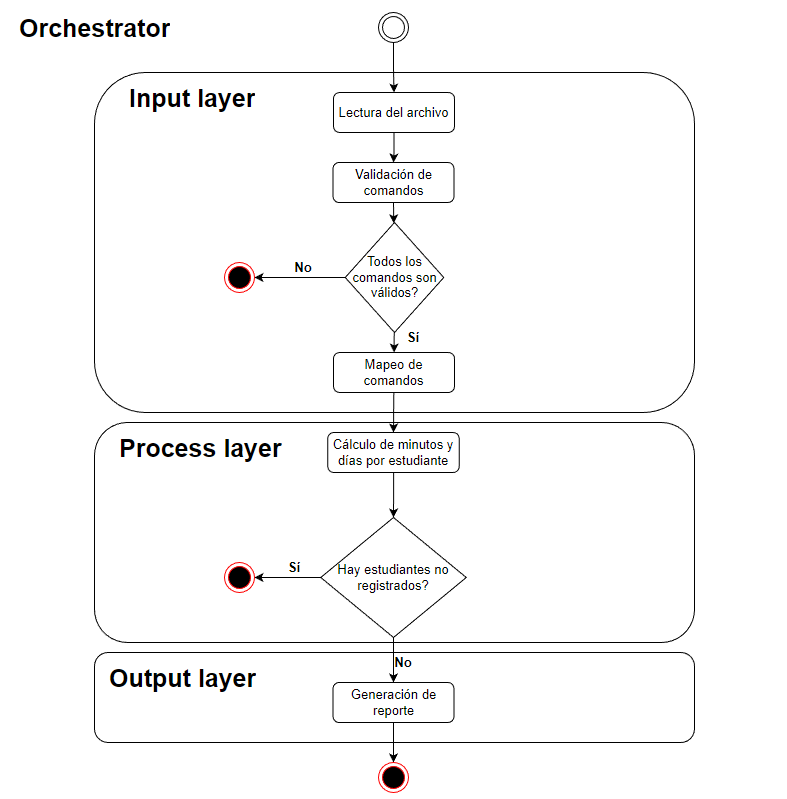

# Aplicación de Registro de Asistencia Estudiantil

La aplicación fue desarrollada con Python y fue estructurada por capas. Cada capa tiene su función particular, y sus implementaciones se utilizan en el orquestador que actúa como un pipeline que recibe todas las dependencias, y el resultado de una lo recibe otra hasta llegar al resultado final.

## Estructura de Capas
La aplicación está estructurada en tres capas principales que interactúan entre sí siguiendo el flujo representado en el siguiente diagrama:



### Capa de Entrada (Input Layer)
En esta capa se realizan los siguientes procesos:
- **Lectura de archivo**: Recibe la ruta del archivo y retorna su contenido.
- **Validación de contenido**: Verifica que el contenido del archivo cumpla con la estructura establecida (que se presenten las palabras claves `Student` y `Presence`, que las horas y días sean válidos, etc)
- **Mapeo de datos**: Si el contenido es válido, se mapean los comandos de estudiantes a una lista de estudiantes y los de asistencias a una lista de objetos de asistencias.

### Capa de Procesamiento (Process Layer)

Esta capa contiene la lógica de negocio de la aplicación. Recibe los datos mapeados y, a partir de ellos, realiza el cálculo de minutos y días por estudiante, almacenando esta información en una estructura de datos que luego retorna.

### Capa de Salida (Output Layer)

En esta última capa, se recibe la estructura generada por la capa de procesamiento y se genera el contenido que se escribirá en el reporte. Este contenido se escribe en un nuevo archivo y luego se retorna.

## Archivos Principales

### logger

Se encarga de la configuración de los logs de la aplicación, estableciendo el formato en el que deben imprimirse, el nombre del archivo donde se deben almacenar y retorna un objeto `log`.

### app

Contiene todas las dependencias que va a necesitar el orquestador, lo instancia y lo retorna.

### main

Es el punto de entrada de la aplicación.

## Consideraciones

- Si algún comando en el archivo no es correcto o no cumple con la estructura entregada, el programa termina e informa sobre el comando inválido.
- Si algún estudiante no se encuentra registrado y tiene una presencia, el programa termina e informa sobre estos estudiantes.

## Ejecución de la Aplicación

Para ejecutar la aplicación, usar el comando:
```sh
python main.py file.txt
```
## Estructura del Proyecto

- **Clases abstractas y sus implementaciones**: Cada una de las capas tiene clases abstractas y sus implementaciones. Al ser un problema pequeño solo creé una implementación por abstracción, pero si fuera más grande o creciera en el futuro esto permitiría la creación de nuevas implementaciones que sigan la misma estructura y no ocurran inconsistencias.

- **Inyección de dependencias**: El orquestador utiliza inyección de dependencias, es decir, las dependencias se pasan a través del constructor en lugar de instanciarse dentro. Se especifica el tipo de cada una (clases abstractas) como información al programador sobre el contrato que deben cumplir. Esto permite mantener el código desacoplado y evitar depender de una instancia y su implementación particular, lo que puede dificultar su extensión en el futuro. De esta forma también me permitió realizar pruebas unitarias fácilmente, ya que pude crear mocks para simular las dependencias y sus resultados.

- **Estructuras de datos personalizadas**: Para ciertas clases (`StudentAttendanceRecorderUseCase`, `TextFileReader`, `TextFileWriter` y `CommandInputValidator`), utilicé estructuras de datos personalizadas para poder validar manualmente. De esta forma podía hacer el código más legible al evitar lanzar excepciones en caso de un error.
